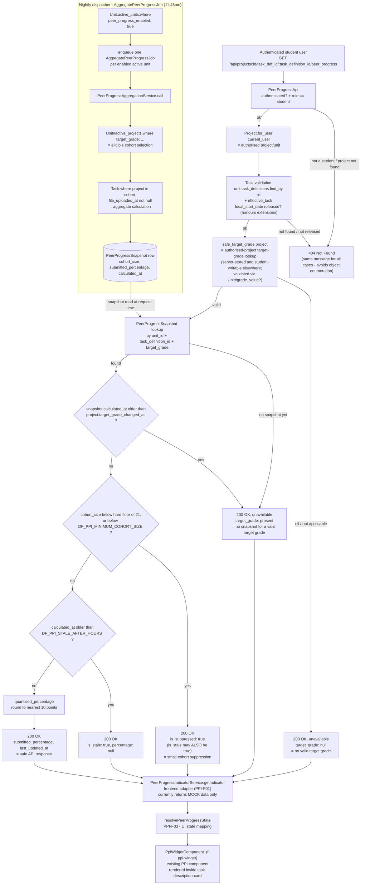

# Peer Progress Indicator — Backend Data-Source Map

**Ticket:** PPI-D02 — Publish the peer-progress backend data-source and field-ownership map
**Status:** Documentation only. No production code is implemented or modified by this ticket.
**Builds on:** [PPI API discovery](./task-completion-data-discovery.md) — the earlier starter task that
located existing task-completion data (`Task`, `TaskStatus`, `Project#task_stats`,
`Unit#student_task_completion_stats`) and found it was not reachable by students. This document goes
one level deeper: it maps the current backend implementation against the agreed PPI response contract,
field by field, and records what is still open.

## Implementation status

PPI-B01 was developed on `ppi/student-progress-endpoint` and merged into the shared
`feature/peer-progress-indicator` branch through API PR #16 (merge commit `1e011b12`). The source branch
has since been deleted. Everything marked "available" below is therefore available on the shared
objective branch; the PR #16 head (`91d4db95`) remains the useful review snapshot for the implementation.

This document does not implement or modify that backend code. It records what the merged implementation
contains so the rest of the team can build against it without re-discovering it.

---

## 1. Backend data-source table

| File | Class / method | Branch | Role |
|---|---|---|---|
| `app/api/peer_progress_api.rb` | `PeerProgressApi` (Grape API), `get '/projects/:id/task_def_id/:task_definition_id/peer_progress'` | `feature/peer-progress-indicator` (PPI-B01, merged via #16) | Student-facing endpoint. Authorises the request, looks up the stored snapshot, applies suppression/staleness rules, returns the allowlisted response. |
| `app/models/peer_progress_snapshot.rb` | `PeerProgressSnapshot` | `feature/peer-progress-indicator` (PPI-B01, merged via #16) | One row per `(unit, task_definition, target_grade)`. Stores `cohort_size`, `submitted_percentage`, `calculated_at`. Validates target grade is enabled for the unit and covers the task. |
| `app/services/peer_progress_aggregation_service.rb` | `PeerProgressAggregationService.call(unit:, calculated_at:)` | `feature/peer-progress-indicator` (PPI-B01, merged via #16) | Batch job logic. For each grade value in the unit, selects the eligible cohort and counts submissions per task, then upserts `PeerProgressSnapshot` rows. |
| `app/sidekiq/aggregate_peer_progress_job.rb` | `AggregatePeerProgressJob#perform(unit_id = nil)` | `feature/peer-progress-indicator` (PPI-B01, merged via #16) | Scheduled dispatcher selects active, PPI-enabled units and enqueues one job per unit. Each per-unit job rechecks active/enabled state before calling the aggregation service. Scheduled via `config/schedule.yml` — `"every day at 11:45pm"`. |
| `db/migrate/20260809153000_create_peer_progress_snapshots.rb` | — | `feature/peer-progress-indicator` (PPI-B01, merged via #16) | Creates `peer_progress_snapshots` table. Comment in the migration explicitly flags `cohort_size` as "Internal only. Never expose this raw value through the student API." |
| `db/migrate/20260810033824_add_peer_progress_enabled_to_units.rb` | — | `feature/peer-progress-indicator` (PPI-B01, merged via #16) | Adds `units.peer_progress_enabled` boolean, `default: false, null: false`. |
| `app/models/unit.rb` | `Unit#active_projects` | `feature/peer-progress-indicator` (pre-existing) | Reused as the base scope for cohort selection (`unit.active_projects.where(target_grade: …)`). |
| `app/models/unit.rb` | `Unit#grade_value?` | `feature/peer-progress-indicator` (pre-existing) | Reused to validate a project's `target_grade` is actually a value the unit has enabled, both when aggregating and when deriving the safe target grade for a request. |
| `app/models/unit.rb` | `Unit.active_units` | `feature/peer-progress-indicator` (pre-existing) | Reused so the nightly dispatcher skips inactive units. The job further scopes this relation to `peer_progress_enabled: true`. |
| `app/models/project.rb` | `Project.for_user(user, include_inactive)` | `feature/peer-progress-indicator` (pre-existing) | Reused to authorise that the requested project actually belongs to the authenticated student. |
| `app/models/task.rb` | `Task#file_uploaded_at` | `feature/peer-progress-indicator` (pre-existing column) | The signal used to decide whether a task counts as "submitted" for aggregation — see note below, this is **not** the same signal the original discovery task found. |
| `app/models/project.rb` | `Project#target_grade_changed_at`, `#record_target_grade_change` (`before_create`/`before_update` callback) | `feature/peer-progress-indicator` (PPI-B01, merged via #16) | New column + callback. Records when a student's target grade last changed, so a snapshot calculated *before* a grade change is never shown as if it applied to the new grade. Backfill migration sets it to "now" for all existing projects — see §5. |
| `db/migrate/20260818160804_add_target_grade_changed_at_to_projects.rb` | — | `feature/peer-progress-indicator` (PPI-B01, merged via #16) | Adds `projects.target_grade_changed_at`, backfilled to the migration run time for existing rows, then `NOT NULL`. |
| `app/api/units_api.rb`, `app/api/entities/unit_entity.rb` | `PUT /units/:id` accepts `peer_progress_enabled`; `UnitEntity` exposes it gated by `can_read_unit_config?` | `feature/peer-progress-indicator` (PPI-B01, merged via #16) | Convenors can toggle PPI on/off through the normal unit-update endpoint. Visibility remains staff-only, matching the "students never see raw config" pattern. |

### Divergence from the original discovery task

The [earlier discovery](./task-completion-data-discovery.md) found `Unit#student_task_completion_stats`
and `Project#task_stats` as existing, reusable aggregation infrastructure, built on `TaskStatus.complete`.
**PPI-B01 does not reuse either of them.** It introduces a parallel, PPI-specific path instead:

- Completion signal: `Task.where(...).where.not(file_uploaded_at: nil)` (a file has been uploaded), not
  `task_status_id == TaskStatus.complete.id`. Note this changed mid-development from an earlier
  `submission_date`-based check to `file_uploaded_at` — if you're comparing against an older read of
  this branch, that's the difference.
- Storage: a new `PeerProgressSnapshot` table, calculated nightly, not the ad-hoc per-request
  `Unit#student_task_completion_stats` calculation.

This looks like a deliberate design choice (a stored nightly snapshot makes the suppression/staleness
checks in the student-facing endpoint cheap and simple), not an oversight. It's recorded here so nobody
assumes the two paths are the same thing, and so **PPI-T01** (calculation rules) has an accurate
starting point if "submitted" vs "complete" needs revisiting.

---

## 2. PPI field-ownership table

Response contract as implemented in `PeerProgressApi#peer_progress_payload` on
`feature/peer-progress-indicator`. All 9 fields are implemented and merged; **none are conceptually
missing from the task-level response design**.

| Field | Purpose | Current backend source | Available / Calculated / Missing | Transformation | Owning ticket |
|---|---|---|---|---|---|
| `task_definition_id` | Task context | Request param, validated via `unit.task_definitions.find_by(id:)` | Available | Passthrough of the validated ID | PPI-B01 |
| `unit_id` | Unit context | `project.unit_id` | Available | Passthrough | PPI-B01 |
| `target_grade` | Authorised-project target-grade lookup | `Project#target_grade`, validated through `Unit#grade_value?` inside `safe_target_grade` | Available (validated, not a raw column read) | Returns `nil` if the project has no target grade or it isn't enabled for the unit. This route accepts only `:id` and `:task_definition_id`, so a grade cannot be supplied directly to this request. However, `Project#target_grade` is student-writable through the existing project-update API: it is server-stored, not server-controlled. The timestamp guard withholds older snapshots until the next aggregation, but does not permanently bind a student to one grade band. See §5. | PPI-B01 / PPI-S01 |
| `submitted_percentage` | Anonymous submitted percentage | `PeerProgressSnapshot#submitted_percentage`, computed nightly by `PeerProgressAggregationService#percentage` from `file_uploaded_at` presence counts; the PPI demo seed also refreshes these snapshots before it finishes | Calculated (batch, not live) | Stored rounded to 2 dp; **quantised to the nearest 10 percentage points** at request time (`quantised_percentage`, `PeerProgressApi`) before being returned. The 10-point bucket is paired with a hard cohort floor of 21 and the relationship is pinned by API tests that reject singleton buckets. Forced to `nil` (never `0` used as a sentinel) whenever suppressed, stale, disabled, unavailable, or the snapshot predates the student's last target-grade change. A stored genuine zero remains distinct from `nil`, but a client-facing `0.0` can also mean a small non-zero percentage rounded into the zero bucket. | PPI-B01 (endpoint) / PPI-T01 (whether submission-based is the right definition, and whether 10-point buckets are the agreed granularity) |
| `is_suppressed` | Small-cohort suppression | Computed per-request: `snapshot.cohort_size < minimum_cohort_size!` (env-configured, but hard-floored at `MINIMUM_SAFE_COHORT_SIZE = 21` regardless of config) | Calculated | `cohort_size` itself is read internally but **never included** in the response. An empty cohort (0 students) is deliberately treated identically to "below threshold" — the response can't distinguish "nobody's in this grade band" from "too few to show," by design. **Can be `true` at the same time as `is_stale`** — suppression and staleness are not mutually exclusive branches. The count includes the requesting student's project, so a cohort of 21 means 20 peers plus the reader. | PPI-S01 (approve the threshold) / PPI-B01 (implementation) |
| `is_stale` | Data freshness | Computed per-request: `snapshot.calculated_at < ENV['DF_PPI_STALE_AFTER_HOURS'].hours.ago` | Calculated | Computed once and threaded through every branch, so it can appear alongside `is_suppressed: true` in the same response — see above. | PPI-T01 (approve the freshness window) / PPI-B01 (implementation) |
| `is_feature_enabled` | Whether PPI is on for this unit | `units.peer_progress_enabled` column, `default: false`; settable via `PUT /units/:id` | Available | None | Unit-level config remains convenor-controlled for normal units. The demo-only `db:ppi_sample_data` task opts its synthetic `PPI1001` / `PPI1002` units in on both first run and rerun. See §5. |
| `last_updated_at` | Snapshot freshness display | `snapshot.calculated_at.utc.iso8601` | Available when a snapshot exists, else `nil` | ISO 8601 UTC string | PPI-B01 / PPI-F01 (display formatting) |
| `unavailable_message` | Safe unavailable message | Hardcoded Ruby constants in `PeerProgressApi` (`UNAVAILABLE_MESSAGE`, etc.) | Available, but **placeholder wording** | None | PPI-D01 — user-facing wording is explicitly out of scope for PPI-B01; the current strings are implementation placeholders, not approved copy. |

### Fields the response must never include (confirmed by code review)

`peer_progress_payload` is an allowlist — it only ever builds the 9 fields above. Confirmed absent:
peer names, usernames, student IDs, peer project IDs, marks, feedback, individual task statuses, raw
cohort records, and raw `cohort_size` / submitted counts. The migration comment on `cohort_size`
explicitly flags it as internal-only. This satisfies acceptance criterion 6 based on the code merged
through API PR #16. That PR received a privacy-focused independent review and corrective commit; the
dedicated PPI-S01 ticket should still decide the explicitly retained risks listed in §5 against the
merged code and deployment settings.

---

## 3. Proposed / actual data-flow diagram



---

## 4. Safe example responses

Reproduced from the merged `docs/peer-progress-api.md` (PPI-B01), which documents these in more state
variations than required here. Shown in the backend's snake_case; the task-widget frontend model
(`PeerProgressIndicator`) uses the corresponding camelCase names (`submittedPercentage`,
`isSuppressed`, etc.). Its current `targetGrade` and `lastUpdatedAt` types are incorrectly non-nullable
for this response contract and must be widened before the live adapter lands — see §5.

### Normal aggregate result

Note `submitted_percentage` is quantised to the nearest 10 — the raw stored aggregate (e.g. 62.5) is
never returned; this example shows the quantised value the client actually receives.

```json
{
  "task_definition_id": 12,
  "unit_id": 5,
  "target_grade": 2,
  "submitted_percentage": 60.0,
  "is_suppressed": false,
  "is_stale": false,
  "is_feature_enabled": true,
  "last_updated_at": "2026-08-10T03:15:00Z",
  "unavailable_message": ""
}
```

### Small-cohort-suppressed result

```json
{
  "task_definition_id": 12,
  "unit_id": 5,
  "target_grade": 2,
  "submitted_percentage": null,
  "is_suppressed": true,
  "is_stale": false,
  "is_feature_enabled": true,
  "last_updated_at": "2026-08-10T03:15:00Z",
  "unavailable_message": "Peer progress is currently unavailable."
}
```

### Unavailable result — no valid target grade

```json
{
  "task_definition_id": 12,
  "unit_id": 5,
  "target_grade": null,
  "submitted_percentage": null,
  "is_suppressed": false,
  "is_stale": false,
  "is_feature_enabled": true,
  "last_updated_at": null,
  "unavailable_message": "Peer progress is currently unavailable."
}
```

### Unavailable result — valid target grade, no usable snapshot yet

This is also what a student sees after changing their target grade, until the next successful
aggregation creates a snapshot newer than that change. Environments that already contain PPI snapshots
when the target-grade timestamp migration runs see the same state until aggregation is rerun — see §5.

```json
{
  "task_definition_id": 12,
  "unit_id": 5,
  "target_grade": 2,
  "submitted_percentage": null,
  "is_suppressed": false,
  "is_stale": false,
  "is_feature_enabled": true,
  "last_updated_at": null,
  "unavailable_message": "Peer progress is currently unavailable."
}
```

---

## 5. Confirmed status, gaps and unresolved decisions

| # | Gap / decision | Detail | Owner |
|---|---|---|---|
| 1 | **Backend merged** | PPI-B01 merged through API PR #16 at `1e011b12`; the implementation is present on `feature/peer-progress-indicator` and the source branch was deleted. | PPI-B01 (complete) |
| 2 | **Frontend live-adapter mismatch** | The current mock widget calls `getIndicator(taskDefId, unitId, targetGrade, mockState)`. The real route expects an authorised project ID (`:id`) plus `:task_definition_id`; it derives unit and grade from that project. PPI-F01 should replace the mock signature with a project/task request, not forward `unitId`, `targetGrade`, or `mockState`. It must also widen `PeerProgressIndicator.targetGrade` and `.lastUpdatedAt` to accept `null`, as the backend contract does. | PPI-F01 |
| 3 | **Two distinct frontend PPI contracts** | Both contracts are now merged into the web objective branch. `PeerProgressIndicator` / `PeerProgressIndicatorService` represents the task-level percentage widget. `PeerProgressResponse` / `PeerProgressService` represents a weekly burndown median with different fields. This is not a rename conflict and the types are not interchangeable; both services remain mock-backed pending their respective live API work. | PPI-F01 / burndown API owner |
| 4 | **Production config still needs approval** | `doubtfire-deploy` 11.0.x supplies local-development values in `development/api.env` and both Compose files: `DF_PPI_MINIMUM_COHORT_SIZE=21` and `DF_PPI_STALE_AFTER_HOURS=48`. Production must supply separately reviewed values. The API rejects a cohort setting below the hard floor of 21, and the floor is coupled to the 10-point percentage bucket by tests. | PPI-T01 / PPI-S01 (approve production values) |
| 5 | **Demo sample units are privacy-floor ready** | `units.peer_progress_enabled` still defaults `false` for normal units. The demo-only `db:ppi_sample_data` task opts its synthetic `PPI1001` / `PPI1002` units in and derives the students per class from `DF_PPI_MINIMUM_COHORT_SIZE`, rounding up so every exact-grade cohort meets or exceeds any valid configured threshold. With the local floor of 21, that is 2 classes × 11 students per grade (22 per cohort). It validates configuration, enrolments, released tasks, cohort sizes, and fresh snapshots before returning. Reruns repair current seed-owned roles and enrolments, unit/task definitions, tutorial capacity, required cohorts, and snapshots in an existing sample database. | PPI test-data / integration owner |
| 6 | **Placeholder wording** | `unavailable_message` strings are hardcoded in Ruby, written by whoever built PPI-B01, not reviewed for tone/wording. | PPI-D01 |
| 7 | **Privacy follow-ups remain** | API PR #16 received an independent privacy/authorisation review and the blocking count-recovery issue was fixed before merge. Two accepted follow-ups remain: students can change `Project#target_grade` and read the new band after the next aggregation, so the timestamp guard rate-limits band enumeration rather than closing it; and `cohort_size` includes the requesting student, so the floor of 21 can mean 20 peers plus the reader. | PPI-S01 |
| 8 | **Backfill invalidates snapshots in already-running PPI environments** | `add_target_grade_changed_at_to_projects` backfills existing projects to migration time, so any snapshot calculated before that time is withheld until aggregation runs again. On the first deployment of the complete PPI migration series the snapshot table is created empty, so there is nothing to invalidate. This matters to development or staging environments that ran the earlier snapshot migration and aggregation before applying the later timestamp migration. | PPI-B01 (deploy sequencing) |
| 9 | **Suppression and staleness are not mutually exclusive** | `is_suppressed` and `is_stale` can both be `true`. The current frontend `resolvePeerProgressState` checks `isSuppressed` before `isStale`, so a suppressed-and-stale response resolves to the "hidden" UI state. PPI-F01/PPI-F03 should confirm that priority is intentional. | PPI-F01 / PPI-F03 |

---

## 6. Explicitly out of scope for this document

This document does not implement the backend endpoint (PPI-B01), the frontend adapter (PPI-F01), the
unit-level component (PPI-F02), percentage calculation rules (PPI-T01), loading/error states (PPI-F03),
the dedicated security follow-up (PPI-S01), or user-facing wording (PPI-D01). It does not create another
mock-data service or another minimal test-data task. Where this document identifies a security-relevant
boundary (§2, §5), that observation does not replace PPI-S01 sign-off on the retained risks.
