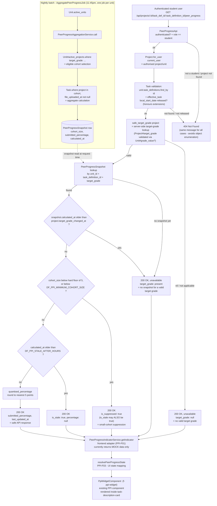

# Peer Progress Indicator — Backend Data-Source Map

**Ticket:** PPI-D02 — Publish the peer-progress backend data-source and field-ownership map
**Status:** Documentation only. No production code is implemented or modified by this ticket.
**Builds on:** [PPI API discovery](./task-completion-data-discovery.md) — the earlier starter task that
located existing task-completion data (`Task`, `TaskStatus`, `Project#task_stats`,
`Unit#student_task_completion_stats`) and found it was not reachable by students. This document goes
one level deeper: it maps the *current, real backend implementation* (found on an unmerged branch)
against the agreed PPI response contract, field by field, and records what is still open.

## Important finding before anything else

At the time of writing, `feature/peer-progress-indicator` (the shared objective branch) has **no PPI
backend code merged into it at all**. A complete, working implementation exists, but it lives on a
separate, unmerged branch: **`ppi/student-progress-endpoint`** (`origin/ppi/student-progress-endpoint`
in `doubtfire-api`, owned by **PPI-B01**). Everything in the tables below that is marked "available" is
available *on that branch*, not on `feature/peer-progress-indicator`. Until PPI-B01 is reviewed and
merged, the shared branch has none of this.

This document does not implement, modify, or take a position on merging that branch — it only records
what it contains so the rest of the team can build against it without re-discovering it.

---

## 1. Backend data-source table

| File | Class / method | Branch | Role |
|---|---|---|---|
| `app/api/peer_progress_api.rb` | `PeerProgressApi` (Grape API), `get '/projects/:id/task_def_id/:task_definition_id/peer_progress'` | `ppi/student-progress-endpoint` (unmerged) | Student-facing endpoint. Authorises the request, looks up the stored snapshot, applies suppression/staleness rules, returns the allowlisted response. |
| `app/models/peer_progress_snapshot.rb` | `PeerProgressSnapshot` | `ppi/student-progress-endpoint` (unmerged) | One row per `(unit, task_definition, target_grade)`. Stores `cohort_size`, `submitted_percentage`, `calculated_at`. Validates target grade is enabled for the unit and covers the task. |
| `app/services/peer_progress_aggregation_service.rb` | `PeerProgressAggregationService.call(unit:, calculated_at:)` | `ppi/student-progress-endpoint` (unmerged) | Batch job logic. For each grade value in the unit, selects the eligible cohort and counts submissions per task, then upserts `PeerProgressSnapshot` rows. |
| `app/sidekiq/aggregate_peer_progress_job.rb` | `AggregatePeerProgressJob#perform(unit_id = nil)` | `ppi/student-progress-endpoint` (unmerged) | Scheduled entry point. Iterates `Unit.active_units` and calls the aggregation service per unit. Scheduled via `config/schedule.yml` — `"every day at 11:45pm"`. |
| `db/migrate/20260809153000_create_peer_progress_snapshots.rb` | — | `ppi/student-progress-endpoint` (unmerged) | Creates `peer_progress_snapshots` table. Comment in the migration explicitly flags `cohort_size` as "Internal only. Never expose this raw value through the student API." |
| `db/migrate/20260810033824_add_peer_progress_enabled_to_units.rb` | — | `ppi/student-progress-endpoint` (unmerged) | Adds `units.peer_progress_enabled` boolean, `default: false, null: false`. |
| `app/models/unit.rb:259` | `Unit#active_projects` | `feature/peer-progress-indicator` (pre-existing) | Reused as the base scope for cohort selection (`unit.active_projects.where(target_grade: …)`). |
| `app/models/unit.rb:337` | `Unit#grade_value?` | `feature/peer-progress-indicator` (pre-existing) | Reused to validate a project's `target_grade` is actually a value the unit has enabled, both when aggregating and when deriving the safe target grade for a request. |
| `app/models/unit.rb:2607` | `Unit.active_units` | `feature/peer-progress-indicator` (pre-existing) | Reused so the nightly job skips inactive units. |
| `app/models/project.rb:124` | `Project.for_user(user, include_inactive)` | `feature/peer-progress-indicator` (pre-existing) | Reused to authorise that the requested project actually belongs to the authenticated student. |
| `app/models/task.rb` | `Task#file_uploaded_at` | `feature/peer-progress-indicator` (pre-existing column) | The signal used to decide whether a task counts as "submitted" for aggregation — see note below, this is **not** the same signal the original discovery task found. |
| `app/models/project.rb` | `Project#target_grade_changed_at`, `#record_target_grade_change` (`before_create`/`before_update` callback) | `ppi/student-progress-endpoint` (unmerged) | New column + callback. Records when a student's target grade last changed, so a stale snapshot calculated *before* a grade change is never shown as if it applied to the new grade. Backfill migration sets it to "now" for all existing projects — see Gaps §5. |
| `db/migrate/20260818160804_add_target_grade_changed_at_to_projects.rb` | — | `ppi/student-progress-endpoint` (unmerged) | Adds `projects.target_grade_changed_at`, backfilled to the migration run time for existing rows, then `NOT NULL`. |
| `app/api/units_api.rb`, `app/api/entities/unit_entity.rb` | `PUT /units/:id` accepts `peer_progress_enabled`; `UnitEntity` exposes it gated by `can_read_unit_config?` | `ppi/student-progress-endpoint` (unmerged) | Convenors can now toggle PPI on/off for a unit through the normal unit-update endpoint — this wasn't there when this document was first drafted (it required a manual DB flip). Still staff-only visibility, matching the "students never see raw config" pattern. |

### Divergence from the original discovery task

The [earlier discovery](./task-completion-data-discovery.md) found `Unit#student_task_completion_stats`
and `Project#task_stats` as existing, reusable aggregation infrastructure, built on `TaskStatus.complete`.
**PPI-B01 does not reuse either of them.** It introduces a parallel, PPI-specific path instead:

- Completion signal: `Task.where(...).where.not(file_uploaded_at: nil)` (a file has been uploaded), not
  `task_status_id == TaskStatus.complete.id`. Note this changed mid-development from an earlier
  `submission_date`-based check to `file_uploaded_at` — if you're comparing against an older read of
  this branch, that's the difference.
- Storage: a new `PeerProgressSnapshot` table, calculated nightly, not the ad-hoc per-request
  `Unit#student_task_completion_stats` calculation.

This looks like a deliberate design choice (a stored nightly snapshot makes the suppression/staleness
checks in the student-facing endpoint cheap and simple), not an oversight. It's recorded here so nobody
assumes the two paths are the same thing, and so **PPI-T01** (calculation rules) has an accurate
starting point if "submitted" vs "complete" needs revisiting.

---

## 2. PPI field-ownership table

Response contract as implemented in `PeerProgressApi#peer_progress_payload`
(`ppi/student-progress-endpoint`). All 9 fields are already implemented on that branch — **none are
conceptually missing from the design**, but none are merged into `feature/peer-progress-indicator`
either, so treat the whole endpoint as unavailable until that branch is reviewed and merged.

| Field | Purpose | Current backend source | Available / Calculated / Missing | Transformation | Owning ticket |
|---|---|---|---|---|---|
| `task_definition_id` | Task context | Request param, validated via `unit.task_definitions.find_by(id:)` | Available | Passthrough of the validated ID | PPI-B01 |
| `unit_id` | Unit context | `project.unit_id` | Available | Passthrough | PPI-B01 |
| `target_grade` | Server-side target-grade lookup | `Project#target_grade`, validated through `Unit#grade_value?` inside `safe_target_grade` | Available (validated, not a raw column read) | Returns `nil` if the project has no target grade or it isn't enabled for the unit. **Never accepts a client-supplied value** — the route only takes `:id` and `:task_definition_id`. | PPI-B01 |
| `submitted_percentage` | Anonymous submitted percentage | `PeerProgressSnapshot#submitted_percentage`, computed nightly by `PeerProgressAggregationService#percentage` from `file_uploaded_at` presence counts | Calculated (batch, not live) | Stored rounded to 2 dp; **quantised to the nearest 5 percentage points** at request time (`quantised_percentage`, `PeerProgressApi`) before being returned — the precise stored value is never sent to the client, an extra anonymity margin on top of cohort suppression. Forced to `nil` (never `0` used as a sentinel) whenever suppressed, stale, disabled, unavailable, or the snapshot predates the student's last target-grade change. A genuine `0.0` result is preserved and distinguished from "no data." | PPI-B01 (endpoint) / PPI-T01 (whether submission-based is the right definition, and whether 5-point buckets are the agreed granularity) |
| `is_suppressed` | Small-cohort suppression | Computed per-request: `snapshot.cohort_size < minimum_cohort_size!` (env-configured, but hard-floored at `MINIMUM_SAFE_COHORT_SIZE = 5` regardless of config) | Calculated | `cohort_size` itself is read internally but **never included** in the response. An empty cohort (0 students) is deliberately treated identically to "below threshold" — the response can't distinguish "nobody's in this grade band" from "too few to show," by design. **Can now be `true` at the same time as `is_stale`** — suppression and staleness are no longer mutually exclusive branches. | PPI-S01 (approve the threshold) / PPI-B01 (implementation) |
| `is_stale` | Data freshness | Computed per-request: `snapshot.calculated_at < ENV['DF_PPI_STALE_AFTER_HOURS'].hours.ago` | Calculated | Computed once and threaded through every branch, so it can appear alongside `is_suppressed: true` in the same response — see above. | PPI-T01 (approve the freshness window) / PPI-B01 (implementation) |
| `is_feature_enabled` | Whether PPI is on for this unit | `units.peer_progress_enabled` column, `default: false`; now settable via `PUT /units/:id` | Available | None | Unit-level config, convenor-controlled. **Not enabled on any unit in the local dev database**, including the `PPI1001`/`PPI1002` sample units created for dashboard testing. See Gaps below. |
| `last_updated_at` | Snapshot freshness display | `snapshot.calculated_at.utc.iso8601` | Available when a snapshot exists, else `nil` | ISO 8601 UTC string | PPI-B01 / PPI-F01 (display formatting) |
| `unavailable_message` | Safe unavailable message | Hardcoded Ruby constants in `PeerProgressApi` (`UNAVAILABLE_MESSAGE`, etc.) | Available, but **placeholder wording** | None | PPI-D01 — user-facing wording is explicitly out of scope for PPI-B01; the current strings are implementation placeholders, not approved copy. |

### Fields the response must never include (confirmed by code review)

`peer_progress_payload` is an allowlist — it only ever builds the 9 fields above. Confirmed absent:
peer names, usernames, student IDs, peer project IDs, marks, feedback, individual task statuses, raw
cohort records, and raw `cohort_size` / submitted counts. The migration comment on `cohort_size`
explicitly flags it as internal-only. This satisfies acceptance criterion 6, based on reading the code
as it stands on `ppi/student-progress-endpoint` — **this is not a substitute for the independent
PPI-S01 review**, which should verify this against the actually-merged code, not this branch snapshot.

---

## 3. Proposed / actual data-flow diagram



---

## 4. Safe example responses

Reproduced from `ppi/student-progress-endpoint`'s own `docs/peer-progress-api.md` (PPI-B01), which
already documents these in more state variations than required here. Shown in the backend's snake_case;
the frontend model (`PeerProgressIndicator`, on `feature/PPI-F03-ppi-widget-states`) maps these 1:1 to
camelCase (`submittedPercentage`, `isSuppressed`, etc.) — field names match, only casing differs.

### Normal aggregate result

Note `submitted_percentage` is quantised to the nearest 5 — the raw stored aggregate (e.g. 62.5) is
never returned; this example shows the quantised value the client actually receives.

```json
{
  "task_definition_id": 12,
  "unit_id": 5,
  "target_grade": 2,
  "submitted_percentage": 65.0,
  "is_suppressed": false,
  "is_stale": false,
  "is_feature_enabled": true,
  "last_updated_at": "2026-08-10T03:15:00Z",
  "unavailable_message": ""
}
```

### Small-cohort-suppressed result

```json
{
  "task_definition_id": 12,
  "unit_id": 5,
  "target_grade": 2,
  "submitted_percentage": null,
  "is_suppressed": true,
  "is_stale": false,
  "is_feature_enabled": true,
  "last_updated_at": "2026-08-10T03:15:00Z",
  "unavailable_message": "Peer progress is currently unavailable."
}
```

### Unavailable result — no valid target grade

```json
{
  "task_definition_id": 12,
  "unit_id": 5,
  "target_grade": null,
  "submitted_percentage": null,
  "is_suppressed": false,
  "is_stale": false,
  "is_feature_enabled": true,
  "last_updated_at": null,
  "unavailable_message": "Peer progress is currently unavailable."
}
```

### Unavailable result — valid target grade, no usable snapshot yet

This is also what a student sees for one full day after a `peer_progress_enabled` unit's target-grade
backfill migration runs (Gaps §5, #8), and after a student changes their own target grade — the snapshot
that existed for their old grade is deliberately not shown for the new one.

```json
{
  "task_definition_id": 12,
  "unit_id": 5,
  "target_grade": 2,
  "submitted_percentage": null,
  "is_suppressed": false,
  "is_stale": false,
  "is_feature_enabled": true,
  "last_updated_at": null,
  "unavailable_message": "Peer progress is currently unavailable."
}
```

---

## 5. Confirmed gaps and unresolved decisions

| # | Gap / decision | Detail | Owner |
|---|---|---|---|
| 1 | **Backend not merged** | The entire implementation described in this document lives on `ppi/student-progress-endpoint` only. `feature/peer-progress-indicator` has none of it. | PPI-B01 |
| 2 | **Frontend target-grade parameter mismatch** | The current widget (`PpiWidgetComponent`, `feature/PPI-F03-ppi-widget-states`) calls `ppiService.getIndicator(taskDefId, unitId, targetGrade, mockState)` — it passes `this.task.project.targetGrade` from the browser. The real endpoint takes only `:id` and `:task_definition_id` and derives target grade itself; it does not accept one. Whoever wires the real HTTP call (PPI-F01) needs to drop the `targetGrade` argument from the service signature rather than forward it, otherwise it looks like the frontend is trying to supply a value the backend was deliberately designed to ignore. | PPI-F01 |
| 3 | **Two divergent frontend model/service names** | `feature/PPI-F03-ppi-widget-states` uses `PeerProgressIndicator` / `PeerProgressIndicatorService`. `feature/ppi-burndown-comparison` renames the same concept to `PeerProgress` / `PeerProgressService` in a separate, unmerged change. Neither branch is aware of the other's rename. Field names inside the interface are otherwise identical. | PPI-F01 |
| 4 | **Config values unset** | `DF_PPI_MINIMUM_COHORT_SIZE` and `DF_PPI_STALE_AFTER_HOURS` have no value anywhere in `doubtfire-deploy` (checked `development/api.env` and the compose files). The code deliberately fails closed (503) rather than assume a default. `DF_PPI_MINIMUM_COHORT_SIZE` additionally has a hardcoded floor of 5 (`MINIMUM_SAFE_COHORT_SIZE`) — even a configured value below 5 is rejected as a config error. That floor itself is a code-level decision, not yet confirmed with PPI-T01/PPI-S01. | PPI-T01 (approve values and the hardcoded floor) |
| 5 | **No unit has PPI enabled** | `units.peer_progress_enabled` defaults `false`, and no unit in the local dev database (including the `PPI1001` / `PPI1002` sample data created for dashboard testing) has it set. There is now a proper way to enable it (`PUT /units/:id` with `peer_progress_enabled: true`, convenor-only) rather than a manual DB flip — but it still hasn't been done for any test unit. Needs the privacy threshold (#4) set first, per the branch's own `docs/peer-progress-api.md`. | Whoever owns turning on the first test unit — likely PPI-B01 or PPI-S01 as part of review |
| 6 | **Placeholder wording** | `unavailable_message` strings are hardcoded in Ruby, written by whoever built PPI-B01, not reviewed for tone/wording. | PPI-D01 |
| 7 | **No independent privacy/authorisation review yet** | This document's field-exclusion check (§2) is a code read, not a security review. | PPI-S01 |
| 8 | **Backfill migration will blank every existing snapshot on deploy** | `add_target_grade_changed_at_to_projects` backfills every existing project's `target_grade_changed_at` to the migration's run time. Since the endpoint refuses any snapshot calculated *before* that timestamp, every student will see "unavailable" immediately after this migration deploys, until the next nightly `AggregatePeerProgressJob` run recalculates fresh snapshots. Not a bug, but worth knowing before flipping `peer_progress_enabled` on a unit right after a deploy — the first day will look broken. | PPI-B01 (deploy sequencing) |
| 9 | **Suppression and staleness are no longer mutually exclusive** | `is_suppressed` and `is_stale` can both be `true` in the same response as of the latest revision of this branch. The current frontend `resolvePeerProgressState` (`feature/PPI-F03-ppi-widget-states`) checks `isSuppressed` before `isStale` in an if/else chain, so a suppressed+stale response still resolves to the "hidden" UI state — consistent, but worth PPI-F01/PPI-F03 confirming that's the intended priority rather than an accident of write order. | PPI-F01 / PPI-F03 |

---

## 6. Explicitly out of scope for this document

This document does not implement the backend endpoint (PPI-B01), the frontend adapter (PPI-F01), the
unit-level component (PPI-F02), percentage calculation rules (PPI-T01), loading/error states (PPI-F03),
the independent security review (PPI-S01), or user-facing wording (PPI-D01). It does not create another
mock-data service or another minimal test-data task. Where this document identifies a security-relevant
boundary (§2, §5), that observation does not replace the independent PPI-S01 review.
